# Vector Bucket 方案与迭代建议 V2.3

## 0. 本版相对 V2.2 的修正

V2.2 的主方向基本正确：

- 产品定位按“对象存储的向量扩展”来定义
- 第一阶段不追求对象存储原生冷查询
- 默认索引从 `HNSW` 调整为 `IVF_SQ8 + mmap + load/release + LRU`
- `HNSW` 作为后续性能档保留

但 V2.2 里仍有三处表述过强，需要修正：

1. 不能说 `IVF_SQ8 + mmap` 和 `HNSW` 的实现复杂度“完全相同”  
   更准确地说是：
   - **控制面复杂度接近**
   - 但 `IVF_SQ8` 需要额外的参数调优和 recall 基准测试

2. 不能说采用 `IVF_SQ8` 后，Phase 2 “不需要迁移/重建”  
   因为从“一个逻辑 collection/index 对应一个物理 collection”迁到“多逻辑 collection/index 共表”，即使索引类型不变，仍然需要：
   - 数据迁移
   - 索引重建
   - 路由切换

3. `mmap` 不能只写成一个抽象开关  
   在当前仓库里，至少要区分：
   - `queryNode.mmap.mmapEnabled`
   - `queryNode.mmap.vectorIndex`
   - collection/index 级的 `mmap.enabled` 属性

因此，V2.3 的核心判断是：

- **Phase 1 默认索引仍推荐 `IVF_SQ8 + mmap + load/release + LRU`**
- 但它的理由应是“**资源更匹配、路线更连贯**”，而不是“几乎零额外成本”

## 1. 产品定位

产品定位保持不变：

**私有云 HCI 平台上，对象存储服务的向量扩展功能**

不对标：

- Pinecone 这类托管向量数据库
- 通用在线毫秒级实时向量检索服务

对外接口保持简单，但资源模型要对齐业界：

- `CreateBucket / DeleteBucket`
- `CreateCollection(or Index) / DeleteCollection(or Index)`
- `PutVectors(bucket, collection, ...)`
- `UpsertVectors(bucket, collection, ...)`
- `DeleteVectors(bucket, collection, ...)`
- `QueryVectors(bucket, collection, topK, filter)`

本文后续统一用：

- **bucket**：资源容器、权限、配额、计费边界
- **logical collection**：bucket 下真正的写入和查询单元

这里的 `logical collection` 在阿里云 / AWS 的语义上可以近似理解为：

- collection
- index
- index table

设计原则：

- 用户按 `bucket -> logical collection` 理解资源
- 用户不感知底层索引类型
- 产品可以演进后端和档位，但接口不变

## 2. 当前资源与约束

当前已知条件：

- HCI 平台上一台虚拟机：`8 vCPU / 16 GB RAM`
- 对象存储服务与本产品混部
- Milvus 底座对象存储由 JuiceFS 提供
- 有一块非 JuiceFS 的高速本地盘
- 查询目标 `topK` 小，按 `1-30` 规划
- 第一阶段不做 Milvus 内核深改
- 向量存储层可用 RAM 预算约 `8 GB`

这意味着：

- RAM 很紧
- page cache、Milvus 底座对象存储服务、Milvus 会争抢资源
- 第一阶段必须优先选择“可交付、可验证”的路线

## 3. 当前 Milvus 的能力边界

### 3.1 查询前提：必须 `LoadCollection`

当前 Milvus 不是“Milvus 底座对象存储上索引文件按需读就能查”的系统。

当前阶段必须接受这个硬约束：

- collection 不 `LoadCollection`
- 即使数据已存在、索引已建好
- 也不能直接搜索

因此，下面这个设想当前不能成立：

- “`IVF_SQ8` 不 load，查询时直接从 Milvus 底座对象存储做冷查询”

### 3.2 `load` 不等于“索引全进 RAM”

这也是 V2.2 补对的关键点。

在当前仓库里：

- `queryNode.mmap.mmapEnabled` 存在，但文档标注为旧总开关
- 更关键的是：
  - `queryNode.mmap.vectorIndex`
  - `queryNode.mmap.vectorField`
- 此外还有 collection / index 级别的 `mmap.enabled` 属性

也就是说，“是否 mmap”不是一句话能说清的，需要按实际版本和配置路径确认。

但大方向成立：

- 开启 vector index mmap 后，`load` 更接近“建立映射 + 借助 page cache / chunk cache”
- 不同索引类型在 mmap 模式下的实际 RAM 行为差异很大

### 3.3 `partition_key` 的定位

`partition_key` 依然有价值，但必须保守定义。

在纠正了资源模型之后，真正适合拿来做路由和 prune 的键不应是单独的 `bucket_id`，而应是：

- `namespace_id = bucket_id + logical_collection_id`

因此更准确的说法是：

- 它是路由与 prune 优化手段
- 不是 bucket 级物理隔离银弹

在当前版本下，它能和 clustering compaction 结合，提升 segment prune 效果。  
但不能直接推导出：

- 每个 logical collection 都有独立物理切片
- 每个 logical collection 查询只扫自己的小索引文件
- 多 logical collections 共表后天然 0 RAM 成本

### 3.4 Milvus 底座对象存储的定位

本文后续统一使用一个名词：

- **Milvus 底座对象存储（由 JuiceFS 提供）**

它在逻辑上就是同一个东西：

- Milvus 的主持久化存储
- Milvus 的底座存储
- Milvus 的权威数据来源

在你当前部署里，它通过 JuiceFS 提供给 Milvus，表现为一个挂载目录。  
也就是说：

- 逻辑角色：Milvus 底座对象存储
- 部署形态：JuiceFS 挂载目录

它不是当前 Phase 1 的“冷查询执行引擎”。

## 4. V2.3 推荐方案

## 4.1 总体策略

V2.3 继续采用下面这条路线：

- 产品定位按 V2 走
- 技术实现按当前 Milvus 能力边界走
- Phase 1 默认索引选 `IVF_SQ8 + mmap + load/release + LRU`
- `HNSW` 不删除，放到 Phase 3 性能档

### 4.2 为什么 Phase 1 默认选 `IVF_SQ8 + mmap`

不是因为它“完全不增加复杂度”，而是因为它在当前资源下更均衡：

- 比 `HNSW` 更节省 RAM
- 比 `HNSW` 更符合“sub-second、成本优先”的产品定位
- 比 `HNSW` 更接近后续标准档路线
- 不需要先引入对象存储原生冷查询这种高风险假设

更准确地说：

- 它和 `HNSW` 在**控制面**上相近
  - 都需要 build / load / release / LRU / TTL
- 但它在**搜索质量与参数侧**有额外工作
  - `nlist`
  - `nprobe`
  - recall 基准测试

### 4.3 为什么 Phase 1 不再推荐 `HNSW` 作为默认档

`HNSW` 仍然是好索引，但它更适合：

- 热点小工作集
- 高 recall
- 低延迟性能档

而不是当前 Phase 1 的默认档。

如果把 `HNSW` 作为默认档，Phase 1 会遇到两个问题：

- RAM 很快成为主瓶颈
- Phase 2 再切到标准档时，迁移成本更高

### 4.4 Phase 1 推荐架构

```text
Client
  -> Bucket Gateway / API
  -> Metadata Service
  -> Namespace Router        (Phase 1: logical collection/index -> 独立 Milvus collection)
  -> Milvus Adapter
  -> IVF_SQ8 Backend (mmap)
  -> Load/Release Controller
  -> LRU / TTL Cache Manager

Milvus 底座对象存储（由 JuiceFS 提供） = Milvus 主持久化存储
本地高速盘                          = chunk cache / mmap 相关本地路径
```

Phase 1 实现原则：

- 用户操作 `bucket + logical collection`
- 每个 logical collection/index 映射到一个独立的物理 Milvus collection
- 默认后端索引使用 `IVF_SQ8`
- 查询前按需 `LoadCollection`
- 空闲 logical collection 由 `TTL + LRU` 触发 `ReleaseCollection`

## 5. 配置与实现假设

### 5.1 mmap 配置不应写成一句话

Phase 1 需要显式验证和配置的项至少包括：

- QueryNode mmap 总开关语义
- `queryNode.mmap.vectorIndex`
- `queryNode.mmap.vectorField`
- collection / index 级 `mmap.enabled`
- mmap 相关本地路径和磁盘空间

当前仓库默认配置中：

- `queryNode.mmap.vectorField = true`
- `queryNode.mmap.vectorIndex = false`

这意味着如果要让向量索引走 mmap，**需要显式改配置并验证行为**，不能只在文档里默认“mmap 已生效”。

### 5.2 Phase 1 需要额外做的验证

相比 `HNSW` 默认方案，`IVF_SQ8 + mmap` 额外需要尽早验证：

- `nlist` / `nprobe` 的起步参数
- recall 是否满足产品底线
- mmap 与 Milvus 底座对象存储本地 cache 的交互
- `LoadCollection` 耗时在当前机器上的上界

因此，V2.3 认为：

- **Phase 1 推荐 `IVF_SQ8 + mmap`**
- 但必须配套 benchmark，而不能只靠静态推理

## 6. 阶段性路线

### Phase 1：单 Collection 可用版

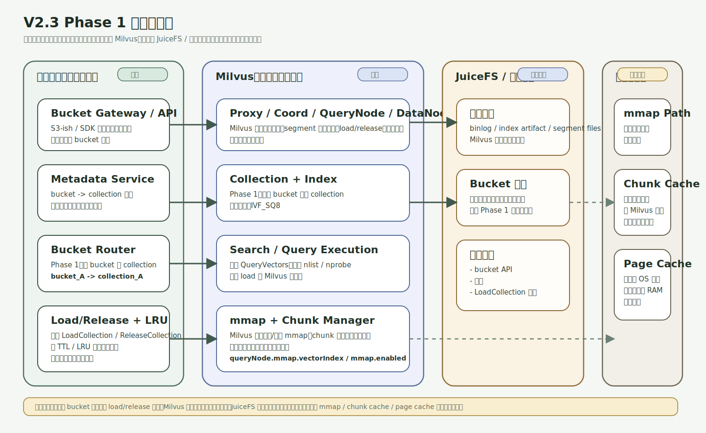

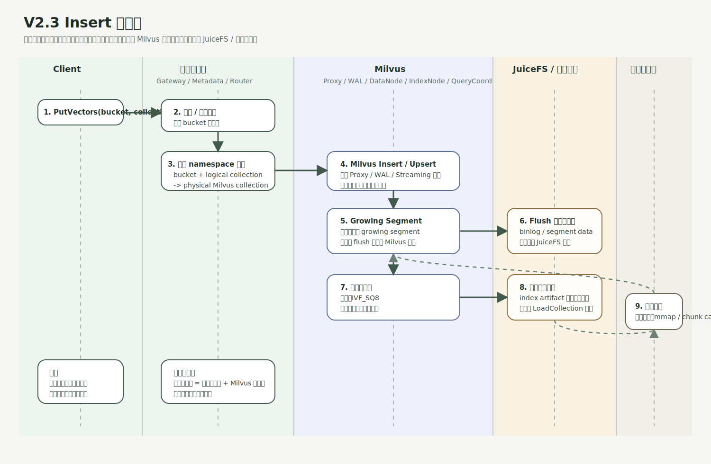

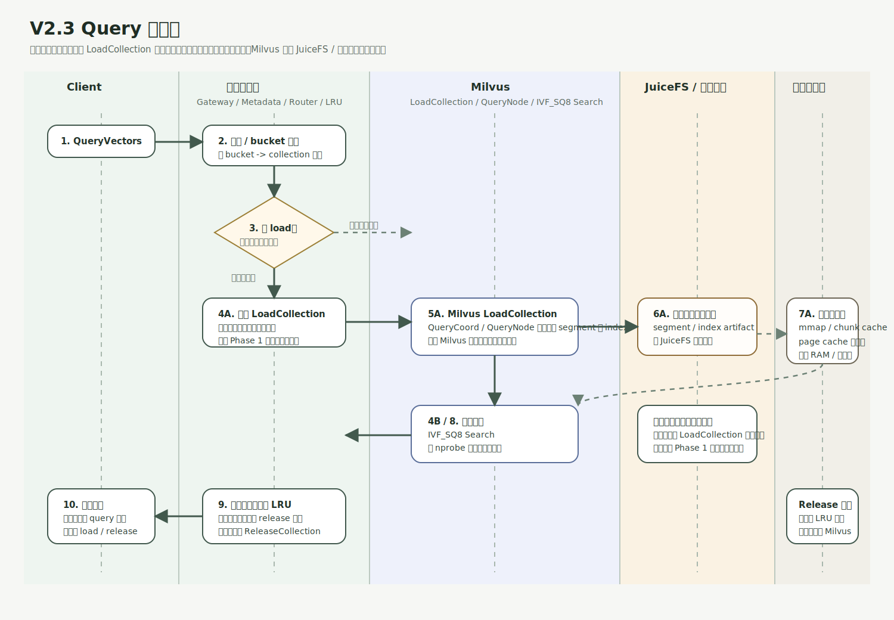

Phase 1 挂载目录建议：

- `Milvus 底座对象存储` 挂载目录  
  例：`/mnt/jfs/milvus-root`
  - 作用：作为 Milvus 主持久化存储根路径
  - 内容：segment data、binlog、index artifact 等持久化文件

- 本地高速盘挂载目录 1  
  例：`/mnt/localssd/mmap`
  - 作用：给 mmap 相关文件使用
  - 内容：Milvus vector index / field mmap 相关本地文件

- 本地高速盘挂载目录 2  
  例：`/mnt/localssd/chunk-cache`
  - 作用：给 chunk cache / 本地缓存使用
  - 内容：Milvus 读取底座对象存储文件后的本地缓存工作集

容器部署时建议 bind mount：

- 宿主机 `/mnt/jfs/milvus-root` -> 容器内 `/var/lib/milvus-data`
- 宿主机 `/mnt/localssd/mmap` -> 容器内 `/var/lib/milvus-mmap`
- 宿主机 `/mnt/localssd/chunk-cache` -> 容器内 `/var/lib/milvus-cache`

交付内容：

- Bucket API
- Metadata Service
- bucket 下 logical collection 的管理 API
- `bucket + logical collection -> 物理 Milvus collection` 映射
- `IVF_SQ8` 建索引
- mmap 配置接入与验证
- `LoadCollection / ReleaseCollection`
- `LRU + TTL`
- 基础监控
- 基础 recall / latency benchmark

明确不做：

- 多桶共表
- logical collection 自动毕业
- HNSW 性能档
- 多后端联合查询
- Milvus 深改

阶段目标：

- 尽快做出可用版
- 用户能创建 bucket
- 用户能在 bucket 下创建 logical collection
- 用户能按 `bucket + logical collection` 写入、查询、删除
- 热点 logical collection 后续查询延迟稳定
- RAM 在当前机器上可控

### Phase 2：共享 Collection 标准档

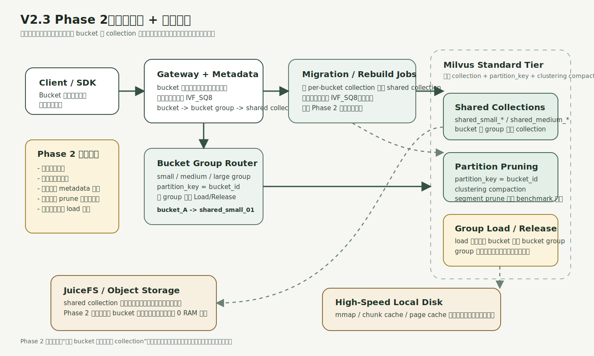

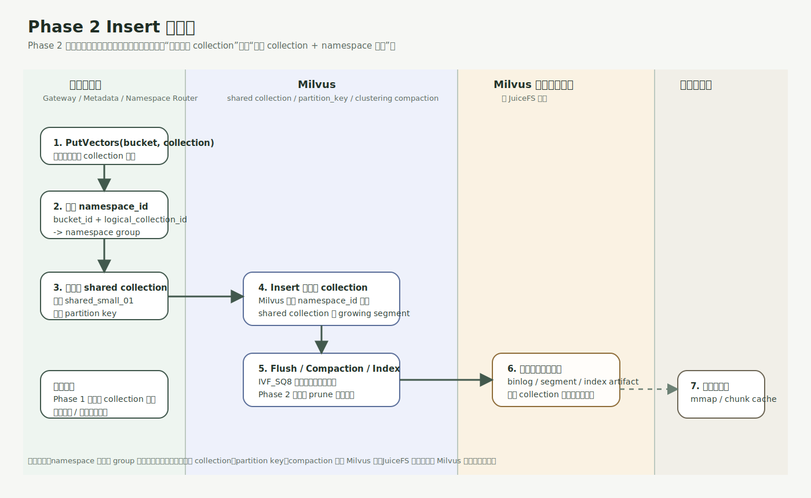

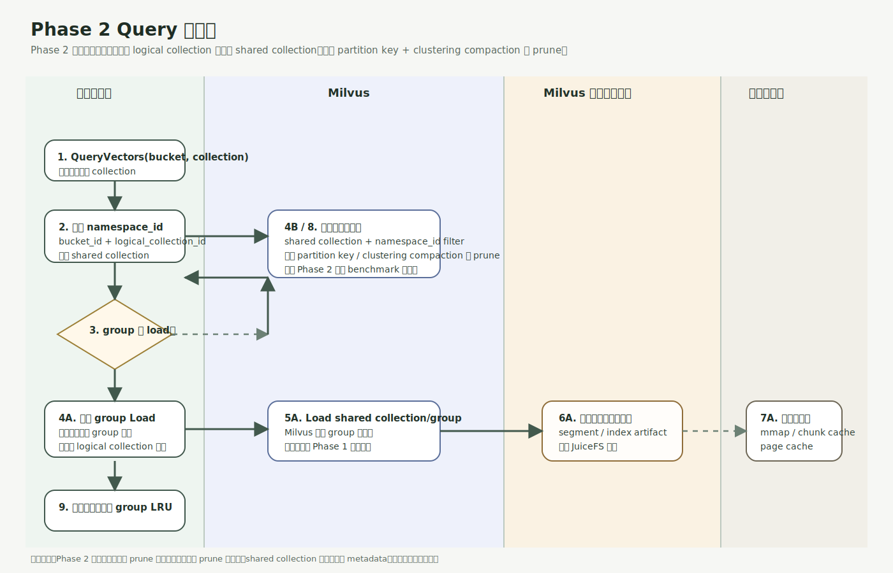

在 Phase 1 稳定后引入：

- 共享 collection 模型
- `namespace_id = bucket_id + logical_collection_id`
- clustering compaction + segment prune 验证
- namespace group 粒度的 load/release
- 索引类型继续使用 `IVF_SQ8`

这一阶段的重点不是“换索引”，而是：

- **降低单位 logical collection 的物理 collection 成本**
- 提高 bucket 数量承载能力

但要明确：

- 即使索引类型不变
- 从“一个 logical collection/index 对应一个物理 collection”迁到“多 logical collections/indexes 共表”
- 仍然需要迁移、重建、切换

### Phase 3：性能档分层版

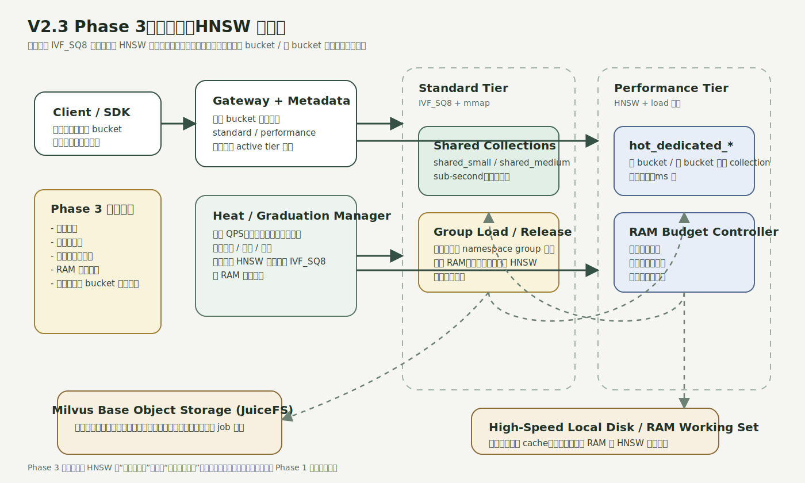

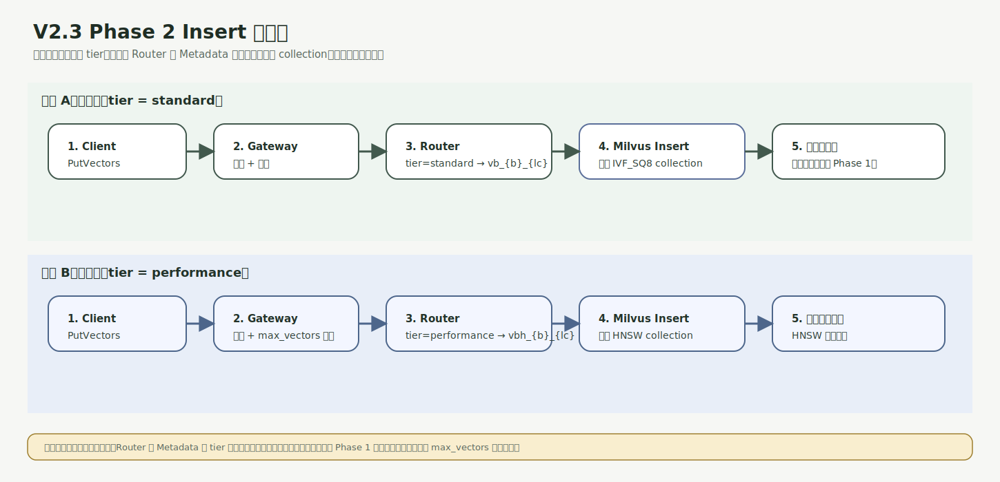

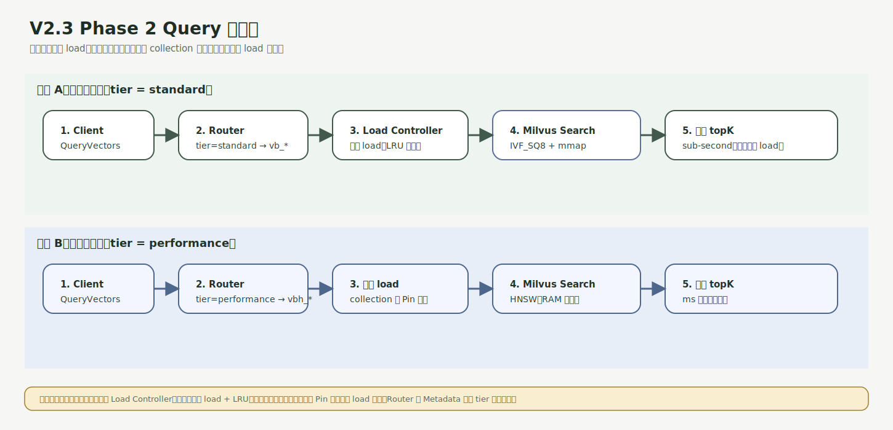

再增加：

- `hot_dedicated_*` collection 模板
- `HNSW + load 常驻`
- 热度统计
- 大 logical collection / 热 logical collection 自动毕业
- 标准档 <-> 性能档离线迁移
- 热档总量硬控

目标：

- 大 logical collection 查询延迟从 sub-second 降到 ms 级
- 产品具备性能梯度

### Phase 4：研究演进版

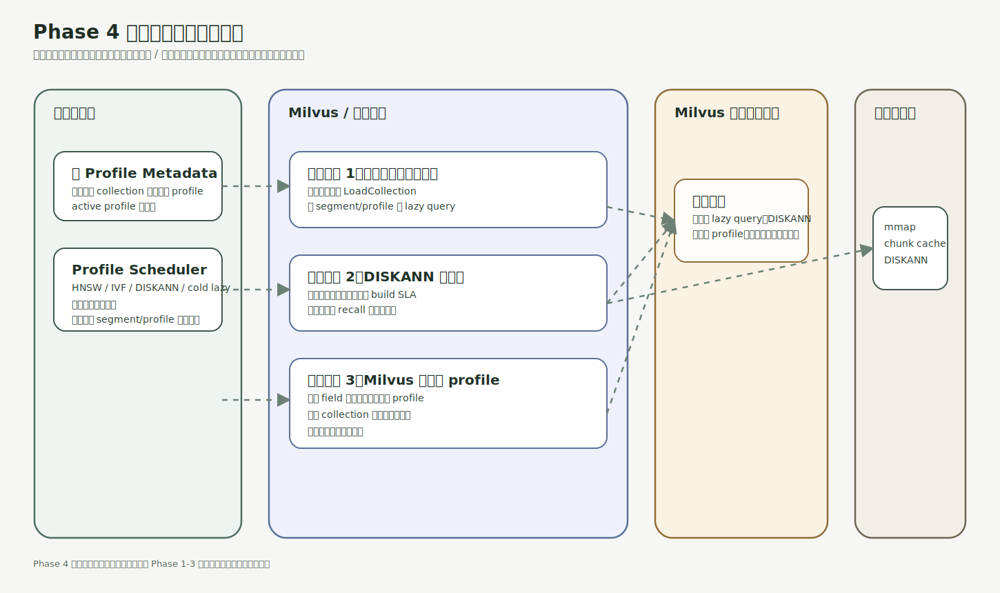

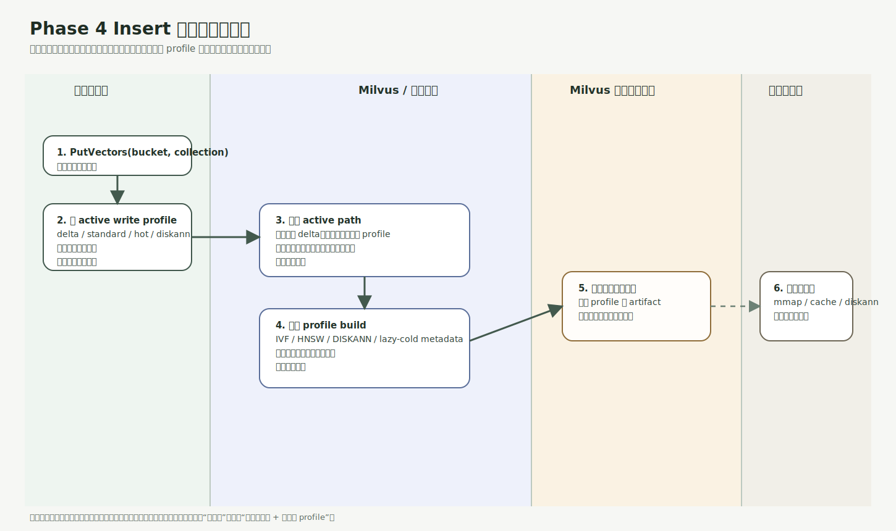

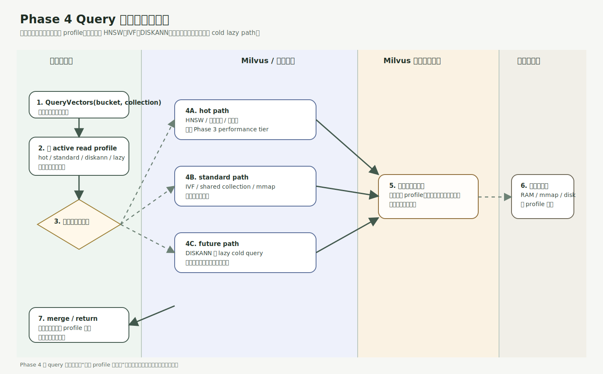

保留但不承诺：

- 真正的对象存储冷查询执行模型
- `DISKANN` 基础层
- Milvus 原生多 profile 支持

`DISKANN` 仍保留为研究备选，不进入近期承诺。

## 7. 资源与容量估算

### 7.1 Phase 1 预算

建议按如下预算规划：

- Milvus 基础进程 + 查询开销：约 `2 GB`
- `IVF_SQ8 + mmap` 活跃 load 集合：约 `4 GB`
- buffer / page cache / 弹性余量：约 `2 GB`

### 7.2 `IVF_SQ8 + mmap` 规模估算

当前更合适把这些数字定义为：

- **规划目标**
- **待 benchmark 验证**

粗略量级可先按下表做容量规划：

| 向量维度 | 粗略可承载活跃加载总量 |
| --- | --- |
| `768D float32` | `200 万 - 350 万` |
| `1024D float32` | `150 万 - 250 万` |
| `1536D float32` | `100 万 - 180 万` |

影响因素包括：

- `nlist`
- `nprobe`
- mmap page cache 命中率
- 底座对象存储本地 cache 命中率
- 并发压力
- 活跃 logical collection 的数量

这些数字不应当作为对外承诺。

### 7.3 HNSW 性能档预算

如果 Phase 3 给 `HNSW` 性能档预留 `4 GB`：

| 向量维度 | 粗略热 logical collection 总容量 |
| --- | --- |
| `768D float32` | `60 万 - 90 万` |
| `1024D float32` | `45 万 - 70 万` |
| `1536D float32` | `30 万 - 50 万` |

这是热档所有 bucket 加起来的上限。

### 7.4 Phase 1 的产品边界

Phase 1 建议主动限制：

- bucket 总数配额
- 每个 bucket 下 logical collection 数量配额
- 活跃加载 logical collection 数硬控
- 单 logical collection 向量数上限
- 不承诺所有冷 logical collections 首查都在 sub-second

因此更适合定义为：

- 可用版
- 预览版
- 限额版

## 8. 工作量评估

### 8.1 Phase 1

工作范围：

- bucket API
- logical collection API
- metadata
- `bucket + logical collection -> physical Milvus collection` 映射
- `IVF_SQ8` 索引管理
- mmap 配置与验证
- load/release 控制
- LRU/TTL
- 基础监控
- recall / latency benchmark

工作量预估：

- PoC：`1-2 周`
- 可用版：`3-5 周`
- 带基础稳定性和观测：`4-6 周`

相较 V2.1 的 `HNSW` 默认方案：

- 控制面开发量接近
- 但基准测试和参数调优工作更多

### 8.2 Phase 2

工作范围：

- 共享 collection 模型
- namespace group 路由
- `namespace_id` 和 clustering compaction 验证
- 数据迁移与索引重建流程
- 路由切换

工作量预估：

- 追加 `4-8 周`

### 8.3 Phase 3

工作范围：

- HNSW 性能档 collection 模板
- 自动毕业 / 降级
- 热度统计
- 后台重建

工作量预估：

- 追加 `3-6 周`

## 9. 风险

### Phase 1 风险

- 冷 logical collection 首查延迟包含 `LoadCollection` 成本
- `IVF_SQ8` 对异常数据集的 recall 可能偏低
- mmap 与 Milvus 底座对象存储本地 cache 的交互需要实测
- logical collection 数量增长仍会带来元数据和调度成本

### Phase 2 风险

- 共享 collection 的隔离性和 prune 效果需要基准测试
- `partition_key` 默认分区数和 clustering compaction 参数需要调优
- namespace group 粒度选错会导致 load 单位过粗
- 即使不换索引类型，迁移仍然是一个真实工程量

### Phase 3 风险

- 升降档迁移抖动
- 热档预算被少数大 bucket 吃光
- 毕业策略复杂度可能高于预期

## 10. 最终建议

V2.3 的最终建议是：

- 产品定位继续按 V2 走
- Phase 1 默认索引采用 `IVF_SQ8 + mmap + load/release + LRU`
- 但把这条路线定义为“**资源更优、路线更顺**”，而不是“几乎零额外成本”
- HNSW 不删除，作为 Phase 3 性能档保留
- `partition_key + 多桶共表` 留到 Phase 2
- `DISKANN` 保留研究路线，不进近期承诺
- Phase 1 主动限制产品边界，并以 benchmark 结果决定是否需要回退到 `HNSW`

一句话总结：

**V2.3 保留了 V2.2 最重要的判断：Phase 1 默认索引优先考虑 `IVF_SQ8 + mmap`；同时把 V2.2 里“复杂度完全相同”“Phase 2 无需迁移”这些过强表述修正成了可执行版本。**
